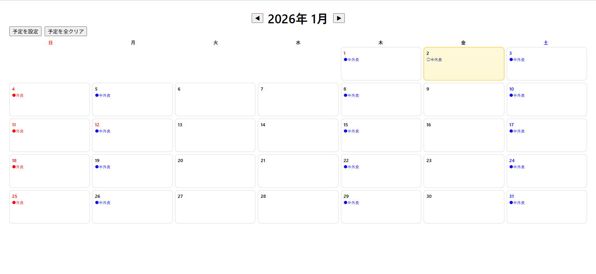

# 外食記録アプリ 🍽️

外食・半外食の **予定と実績をカレンダーで管理**する、シンプルな家計管理用Webアプリです。

「今月、外食どれくらい使ってる？」
「予定してた外食、実際どうだった？」

…を **感覚じゃなくて見える化**するのが目的です。

👉 公開URL  
https://sour39.github.io/gaishoku-log/

---

## ✨ 主な機能

### 📅 カレンダー表示
- 月ごとのカレンダー表示
- 曜日付き（**日曜：赤 / 土曜：青**）
- **祝日を赤色表示**
- **今日の日付をハイライト**

### 📝 予定管理
- 外食 / 半外食を **曜日単位で予定設定**
- 繰り返し予定に対応
- 予定は色分け表示  
  - 🔴 外食  
  - 🔵 半外食

### ✅ 実績記録
- 日付をクリックして実績を入力
- 予定と違う実績も記録可能  
  （例：外食予定 → 半外食に変更）
- 実績は後から **取り消し可能**

### 💾 データ保存
- localStorage 使用
- ログイン不要 / サーバー不要
- ブラウザ内で完結

---

## 🛠 技術スタック

- HTML
- CSS
- JavaScript（Vanilla JS）
- GitHub Pages

フレームワークなしのシンプル構成です。

---

## 📁 ファイル構成
```
gaishoku-log/
├─ index.html
├─ style.css
└─ app.js
```
---

## 🚀 今後やりたいこと（予定）

- 金額入力・月別合計
- グラフ表示
- モバイルUI最適化
- Flutterでのモバイルアプリ化（将来）

---

## 📌 開発メモ

- 「まず小さく作って、動くものを育てる」を重視
- 家計管理のストレスを減らすための個人用ツール

---

## 📷 スクリーンショット


---

## 📄 ライセンス
MIT License
